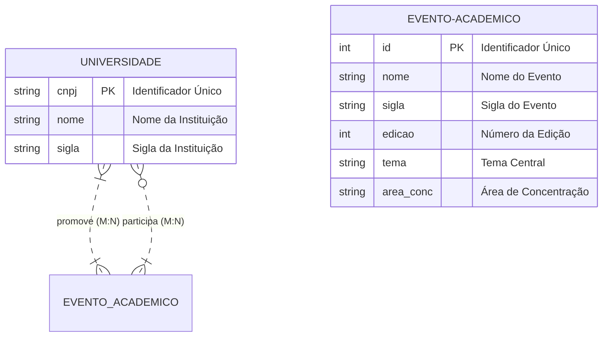
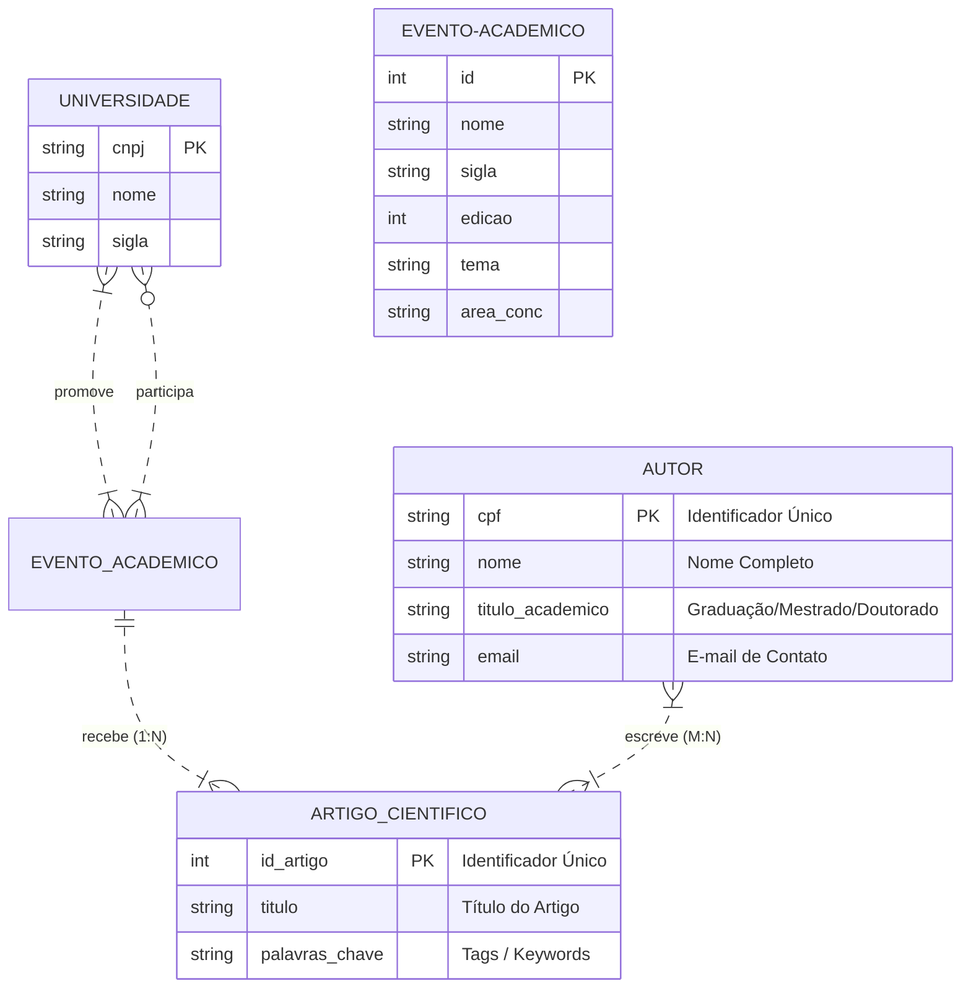
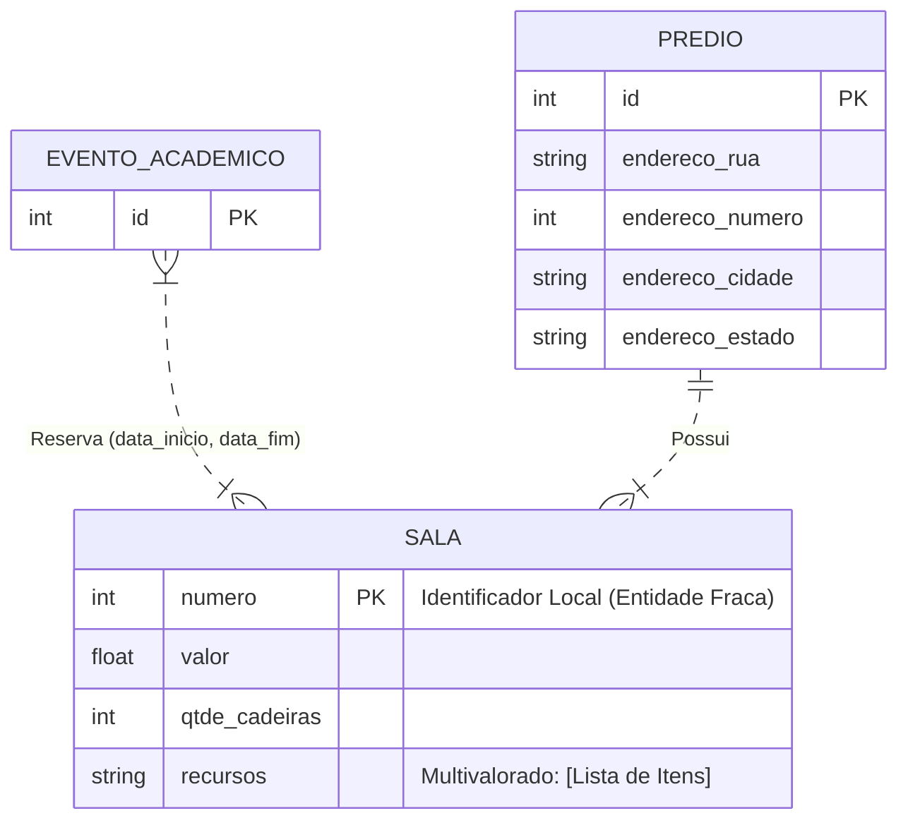

# 📐 Semana 1: Modelagem Conceitual (DER)

Este diretório centraliza os exercícios práticos desenvolvidos durante a primeira semana da disciplina de **Banco de Dados I**. O objetivo das atividades foi exercitar a abstração de cenários reais, extração de regras de negócio e mapeamento de Diagramas Entidade-Relacionamento (DER).

---

## 🛠️ Tecnologias e Conceitos Aplicados
* **Documentação Dinâmica:** Markdown
* **Engine de Modelagem:** Mermaid.js (Diagramação nativa via código no GitHub)
* **Conceitos:** Entidades fortes e fracas, relacionamentos (1:N, M:N), restrições de participação, atributos compostos e multivalorados.

---

## 📌 Exercício 1: Gestão de Eventos Acadêmicos e Universidades

### Enunciado
Projetar o modelo de dados conceitual para um software de gestão de eventos acadêmicos, onde um evento possui ID (único), nome, sigla, edição, tema e área de concentração. O evento deve ser promovido por pelo menos uma universidade (que possui CNPJ único, nome e sigla). As universidades também podem se associar como instituições participantes de múltiplos eventos.

### Diagrama Conceitual (Mermaid)

### Análise Técnica
* **Restrição de Participação Total:** A relação `promove` possui obrigatoriedade do lado do `EVENTO-ACADEMICO` `}|..|{`. Nenhum evento pode ser cadastrado sem ter ao menos uma universidade promotora responsável.

---

## 📌 Exercício 2: Expansão com Artigos Científicos e Autores

### Enunciado
Expandir o modelo do Exercício 1 incorporando artigos científicos e autores. Cada artigo possui ID único, título e palavras-chave, devendo ser necessariamente associado a exatamente um evento e a pelo menos um autor. O cadastro de um autor (com CPF único, nome, título acadêmico e e-mail) só é permitido se ele estiver vinculado a pelo menos um artigo científico.

### Diagrama Conceitual Expandido (Mermaid)

### Análise Técnica
* **Opcionalidade de Evento:** A relação `recebe` indica que um evento pode existir sem nenhum artigo submetido `||..|{`, pois o enunciado prevê outras atividades no evento.
* **Obrigatoriedade do Autor:** O símbolo `}|` em `AUTOR` na relação `escreve` garante a regra de negócio que impede o cadastro de autores sem publicações vinculadas.

---

## 📌 Exercício 3: Engenharia Reversa de Requisitos (Infraestrutura)

### Cenário Deduzido via Análise Gráfica
A partir do mapeamento gráfico de infraestrutura física, a seguinte especificação técnica foi interpretada:

> O sistema gerencia a alocação de espaços físicos para os eventos. Cada **Prédio** possui um ID único e um atributo composto `endereço` (subdividido em `rua`, `numero`, `cidade` e `estado`). Um prédio possui várias salas, mas cada sala pertence a um único prédio. 
> 
> A **Sala** é uma **entidade fraca** cujo `número` serve como identificador parcial/local. Ela registra o `valor` da locação, a `quantidade de cadeiras` e possui um atributo multivalorado chamado `recursos` (para listar múltiplos itens como ar-condicionado ou projetor). 
> 
> Um **Evento Acadêmico** pode efetuar a **Reserva** de múltiplas salas através de um relacionamento N:M, onde o sistema registra obrigatoriamente a `data de início` e a `data de fim` da ocupação.

### Diagrama Conceitual de Infraestrutura (Mermaid)

### Análise Técnica
* **Atributo Composto & Multivalorado:** O endereço do prédio foi atomizado em múltiplos campos para futura conversão lógica. O campo `recursos` foi documentado como uma coleção multivalorada direta na entidade fraca `SALA`.

---
🔬 *Compilado de atividades entregues como registro de evolução acadêmica.*
